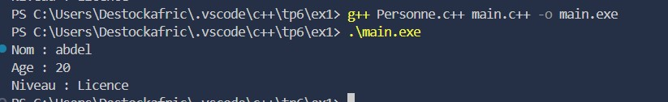
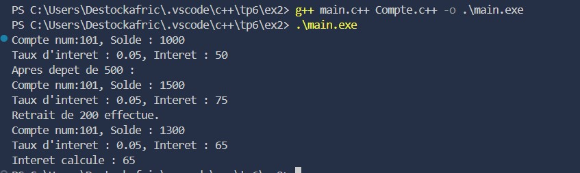
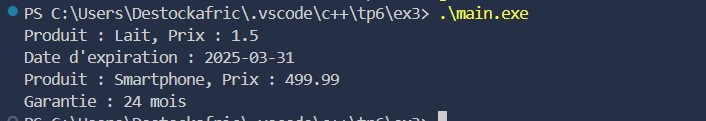
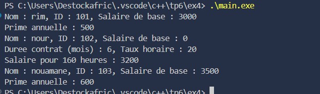

# Projet C++ – Exercices d'Héritage et Statique

Ce projet contient quatre exercices pratiques en C++ pour maîtriser l'héritage, le polymorphisme et les attributs/méthodes statiques.

---

## Exercice 1 – Classe Personne et Etudiant

### Objectifs pédagogiques
- Comprendre la notion de classe dérivée.
- Réutiliser les attributs de la classe de base.
- Initier l’utilisation des constructeurs dans l’héritage.

### Énoncé
- Créer une classe `Personne` avec les attributs `nom` et `age`.
- Créer une classe `Etudiant` dérivée de `Personne` avec un attribut `niveau`.
- Ajouter une méthode `afficher()` dans chaque classe.
- Créer un objet `Etudiant` et afficher ses informations complètes.

### resultat

---

## Exercice 2 – Compte bancaire

### Objectifs pédagogiques
- Appliquer l’héritage public.
- Comprendre l’appel au constructeur de la classe de base.
- Utiliser des méthodes spécialisées dans la classe dérivée.

### Énoncé
- Créer une classe `Compte` avec `numero` et `solde`, méthodes `deposer()` et `retirer()`.
- Créer une classe `CompteEpargne` dérivée avec `tauxInteret` et méthode `calculerInteret()`.
- Instancier un `CompteEpargne` et tester les opérations.

### resultat

---

## Exercice 3 – Hiérarchie de produits

### Objectifs pédagogiques
- Gérer des classes spécialisées avec héritage simple.
- Manipuler le mot-clé `virtual`.
- Organiser un mini-système orienté objet basé sur des catégories de produits.

### Énoncé
- Créer une classe `Produit` avec `nom`, `prix` et méthode virtuelle `afficherInfos()`.
- Créer deux classes dérivées : `ProduitAlimentaire` (avec `dateExpiration`) et `ProduitElectronique` (avec `garantie`).
- Redéfinir `afficherInfos()` dans chaque classe dérivée.

### resultat

---

## Exercice 4 – Système de gestion d'employés

### Objectifs pédagogiques
- Utiliser l’héritage public et le polymorphisme.
- Gérer un destructeur virtuel pour libérer la mémoire.
- Implémenter des méthodes spécialisées dans les classes dérivées.

### Énoncé
- Classe `Employe` avec `nom`, `id`, `salaireDeBase`, méthode virtuelle `afficherInfos()`.
- Classe dérivée `Permanent` avec `primeAnnuelle`.
- Classe dérivée `Contractuel` avec `dureeContrat` et `tauxHoraire` + méthode `calculerSalaireMensuel(int heures)`.
- Créer un tableau dynamique de pointeurs vers `Employe` et afficher les informations de chaque employé.

### Screenshot

